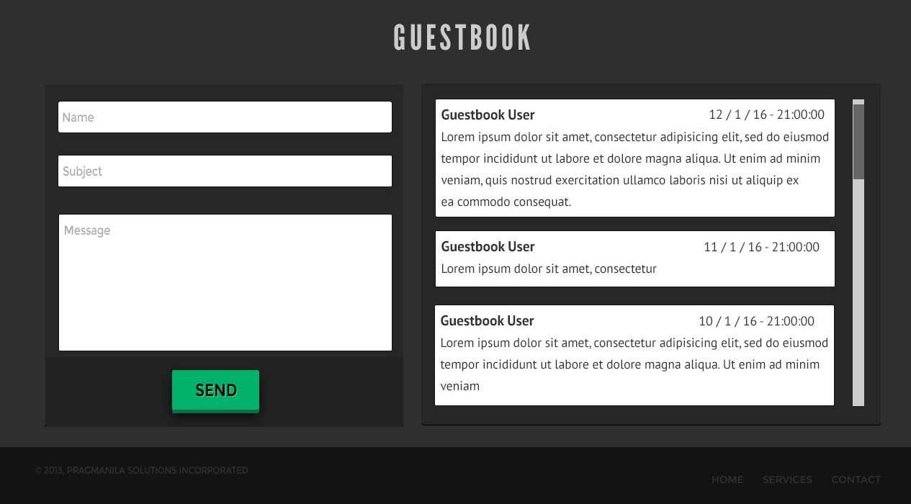
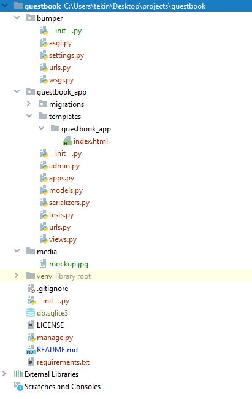

# INSTRUCTIONS
You need to create the backend and frontend of a GuestBook as attached in 
the mockup. You don’t have to make the front end look very pretty, 
basic styling is enough.


- The solution should display a list of all GuestBook entries on the left hand side.
- Allow the user to add an entry by providing name, subject, message and pressing send button.
- Perform server side validation for the parameters name, message and subject
- The backend solution should be a REST API that performs the CRUD operations
- Add appropriate tests to verify the behaviour of the API
- **No Authentication is needed for the API**

## Rules/Pointers:

- Clearly written code is a big plus
- Please use Django Python for programming the backend
- You can pick any database of your choice


## Quickstart
1. Be sure python3.x is installed in your device
2. Create a venv
```shell
    python -m venv venv
```
3. activate venv

    _For windows_
    ```shell
        cd venv/Scripts
        activate
    ```
   
    _For ubuntu_
    ```shell
       source venv/bin/activate
    ```
4. install requirements.txt
   ```python
         pip install -r requirements.txt
   ```
   Update pip(package installer for Python) for unintended warning
   ```python
         python -m pip install --upgrade pip
   ```
   
5. run project
   ```python
         python manage.py runserver
   ```
## Project Tree


## Database
Default database sqlite3

## Templates
There is only one template file for create new post and show posted messages. It is under
the guestbook_app and in templates folder

## Static
There is no static files, I used bootstrap, jquery and swal2 cdn for index template.

## Test
   There are total 8 unittest for restful-api. Run the code below to test all CRUDE 
   operations works fine.
   
   ```python
        python manage.py test
   ```
